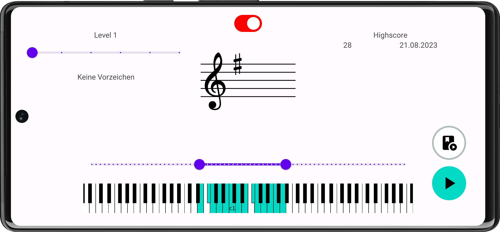
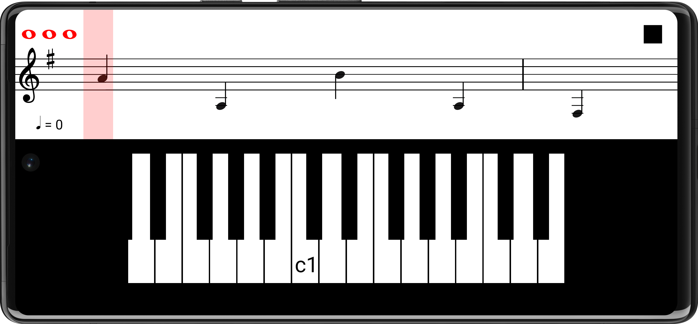

<h1 align="center">
   
  
   
  Notenlesetrainer
   
</h1>

<h4 align="center">Android app to improve reading notes.</h4>

  <a href="#download">Download</a> •
  <a href="#features">Features</a> •
  <a href="#license">License</a> •

  
  

## Download

You can get the app either from [Google Play](https://play.google.com/store/apps/details?id=com.exponential_groth.notenlesetrainer) or install the [Android App Bundle](app/release/app-release.aab) manually.

## Features

You can select the
- key
- type and frequency of accidentals
- range of tones

Additionally, the game can be played either freely or with rhythm / under time constraints.
There is a practice mode for both, in the ladder one's the speed of the notes can be easily adjusted.

## License

Licensed under the Apache License, Version 2.0 (the "License");
you may not use this file except in compliance with the License.
You may obtain a copy of the License at http://www.apache.org/licenses/LICENSE-2.0.